# Hi 👋, I'm Chirag Neelgund

### ECE Student | AI/ML Enthusiast | Python Developer | Core Electronics Explorer

## 🚀 About Me

- 🎓 Electronics & Communication Engineering Student
- 💻 Interested in Python, AI/ML, and Full Stack Development
- ⚡ Passionate about PCB Design, VLSI, and Core Electronics Projects
- 📊 Currently building Sports Analytics and AI Projects
- 🏆 Best Use of Sarvam AI – National Hardware Hackathon 3.0
- 🌱 Learning Backend Development

 

---

## 🌐 Connect With Me

---

## 💻 Software & Development

- 🐍 Python
- 🤖 AI / Machine Learning
- 🌐 Node.js & Express.js
- 🧠 Flask
- 💻 Full Stack Development
- 🛠 VS Code
- 🔧 Git & GitHub
- 📊 Sports Analytics

---

## ⚙️ Electronics & Hardware

- 🔌 PCB Design
- 🧠 Verilog & SystemVerilog
- 📊 MATLAB
- 🛠 Cadence Virtuoso
- ⚡ VLSI
- 🔧 Core Electronics Projects

---

## 🧰 Tech Stack

---

---

## 🔥 GitHub Streak

  

---

---

---

## 🏆 GitHub Trophies

  

---

---

### 💡 "When something is important enough, you do it even if the odds are not in your favor."

— **Elon Musk**

